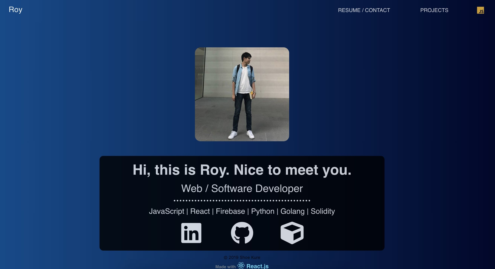

# React portfolio

## Description

Portfolio website built with React.js

***DEMO:***



## Usage / Install
Clone repo, cd into folder and run:

```console
$ npm install
$ npm start
```

## Requirement

- npm

## Tools

- Create-react-app cli
- React MDL material design
- Semantic UI React
- React Router v5
- React-Helmet

## Contribution

## Licence

[MIT](./LICENSE.txt)

## Author

[Shoe Kure](https://github.com/roy1210)

## References
[CRA Tutorial, Portfolio website -Youtube](https://www.youtube.com/watch?v=9AboneIxeM8&t=2s)
[404page -Codepen](https://codepen.io/salehriaz/pen/erJrZM)